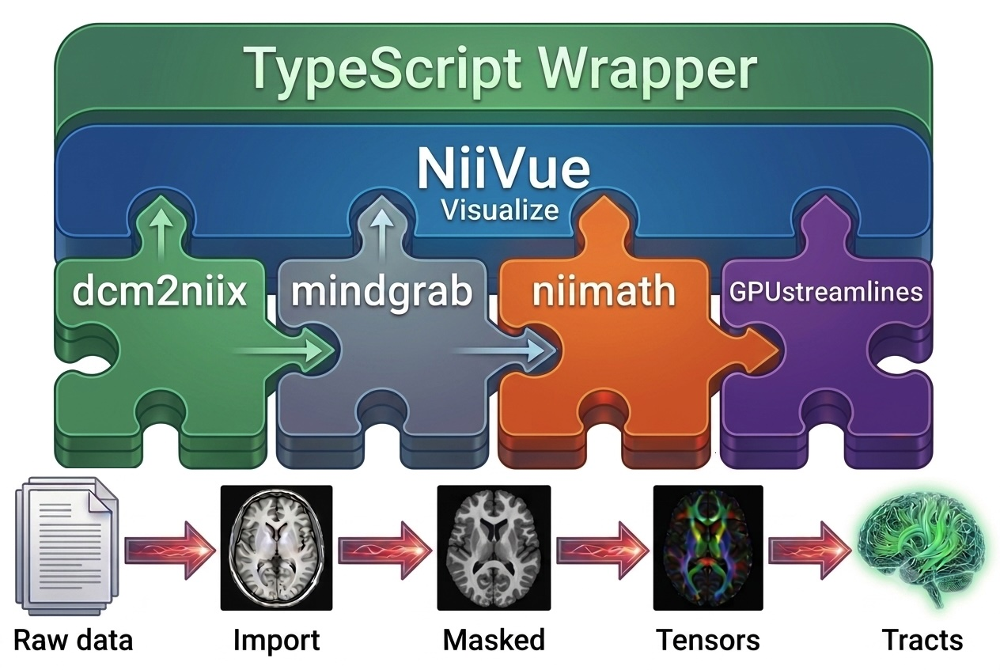

# dwi2trx

A browser-only diffusion-MRI pipeline: drag in a DWI, fit the diffusion tensor, track white-matter streamlines, and save a TRX tractogram. Everything runs client-side (WebAssembly + WebGPU) — **no data ever leaves your machine** — and the whole app is a static page: no install, no upload, no server.

**Live demo: https://rordenlab.github.io/dwi2trx/**

## What it does

1. **Select input** — drag-drop a DWI (a NIfTI + bval + bvec triple, or a folder of DICOMs converted in the browser). You can download sample DICOMs [17_DWI_dir80_AP](https://github.com/neurolabusc/dcm_qa_xa30/tree/main/In/17_DWI_dir80_AP) or sample NIfTI trios [17_DWI_dir80_AP](https://github.com/neurolabusc/dcm_qa_xa30/tree/main/Ref) from the web.
2. **Tensor maps** — fit the diffusion tensor and view the principal eigenvector (V1) coloured by direction and modulated by fractional anisotropy (FA). The fit applies a mindgrab brain mask when WebGPU can run it, falling back to an unmasked fit otherwise.
3. **Streamlines** — track white-matter streamlines on the GPU, render them over the FA in a clipped 3D view, and save a `.trx` tractogram. Seed/stop FA thresholds, step size, turn angle, and seed density are all adjustable.

Needs a recent desktop Chrome or Edge (WebGPU with subgroup support). Or just open the demo and drop in your data.

## Notes

- **qform-only NIfTI** — FSL-preprocessed DWI is frequently stored qform-only (`sform_code = 0`). dwi2trx and its vendored niimath now derive the voxel→world geometry from the qform when the sform is missing, so the brain-masked fit and the streamlines stay aligned with the image.
- **Large datasets** — the constraint is working memory, not file size. A gzipped DWI expands several-fold when decompressed, and tracking then allocates float copies, GPU buffers, readback windows, the TRX, and the 3D mesh on top — so a large DWI (e.g. ~800 MB / 129 volumes) can exhaust browser memory well below any 2 GB file ceiling. The tracker reads streamlines back in bounded windows and retries with smaller batches, and once tracking and TRX serialization succeed the `.trx` stays downloadable even if only the 3D preview runs out of memory. (Memory can still run out earlier — during input decompression, tracking, or TRX assembly — which fails the run.) For big data, start with higher Seed/Stop FA thresholds and lower Density to keep the streamline count (and memory) down.

## Develop

```sh
npm install
npm run dev      # local dev server
npm run build    # static build → dist/
npm run lint     # Biome (lint + format check)
npm test         # unit + DIPY golden tests (Node 22+)
npm run test:e2e # real-WebGPU browser smoke (local-only; needs a GPU)
```

## Design

This web page is a lean TypeScript wrapper around composable building blocks. It illustrates how AI-assisted coding can create useful tools by orchestrating proven, modular components. The current implementation is edge-based, with all processing running in the user's web browser. This preserves privacy (no data leaves the user's computer) and scales easily to many users (each provides their own compute). The trade-off is that every stage needs a lightweight, self-contained tool. The interface could also be extended with cloud resources for heavier processing, as illustrated in our [full-stack demo](https://github.com/niivue/fullstack-niivue-demo).



- [NiiVue](https://niivue.com/) — WebGPU visualization
- [dcm2niix](https://github.com/rordenlab/dcm2niix) — in-browser DICOM → NIfTI ([paper](https://pubmed.ncbi.nlm.nih.gov/26945974/))
- [niimath](https://github.com/rordenlab/niimath) — image processing & tensor fitting ([paper](https://pubmed.ncbi.nlm.nih.gov/39268148/))
- [brainchop](https://github.com/neuroneural/brainchop) — mindgrab brain masking ([paper](https://pubmed.ncbi.nlm.nih.gov/42331200/))
- [GPUStreamlines](https://github.com/dipy/GPUStreamlines) — GPU tractography
